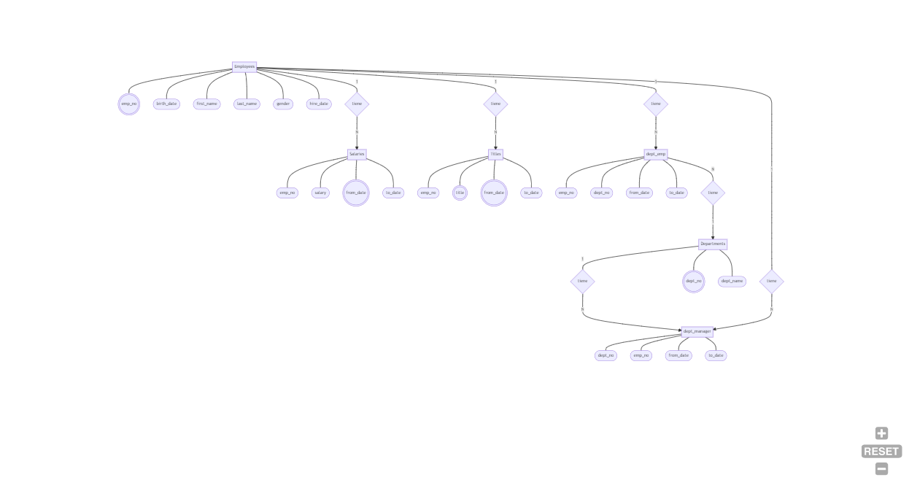

# *Tarea 2  de la clase correspondiente al día 15 de Septiembre de 2022*

**Universidad Autónoma de Nuevo León**

**Facultad de Físico Matemáticas**

**Maestría en Ciencia de Datos**

**Hecha por Ma. Luisa Argáez Salcido**

**Correo Universitario: maria.argaezs@uanl.edu.mx**

**Matricula 2173261**

## **Instrucciones**

1. [8 puntos] Convierte tu base de datos no estructurada en un modelo entidad-relación, representándolo con un diagrama entidad-relación. Usa nodos con figuras correctas y aristas claramente señaladas con los números correspondientes para las relaciones.
2. [2 punto] Muestra el dominio de los atributos.
3. Subir esta descripción en un archivo markdown o PDF nombrado claramente (tarea 1 o algo por el estilo).

## **Respuestas**

1. "Diagrama de entidades de la BD de Employees"
    
   
    
   No encontre el elipse con doble raya, asi que se intercambio por un círculo.
2. El dominio de los atributos se detalla a continuación en el siguiente listado de las entidades:
      
    $Departments$

    |Atributo|Dominio|
    | --- | --- |
    |dept_no (primary_key)|1|
    |dept_name (unique_key)|Ventas|

     

    $Employees$
    |Atributo|Dominio|
    | --- | --- |
    |emp_no|1,2,3,...,n|
    |birth_date|1995-08-07|
    |first_name|Maria|
    |last_name|Argáez|
    |gender|F / M |
    |hire_date|2020-03-17|

     

    $Dept$_$emp$
    |Atributo|Dominio|
    | --- | --- |
    |emp_no|1,2,3,...,n|
    |dept_no|1,2,3,...,n|
    |from_date|2020-03-17|
    |to_date|2022-09-12|

     

    $Dept$_$manager$ 
    |Atributo|Dominio|
    | --- | --- |
    |emp_no|1,2,3,...,n|
    |dept_no|1,2,3,...,n|
    |from_date|2020-03-17|
    |to_date|2022-09-12|

     

    $Title$ 
    |Atributo|Dominio|
    | --- | --- |
    |emp_no|1,2,3,...,n|
    |title|Data Scientist|
    |from_date|2020-03-17|
    |to_date|2022-09-12|

     
    
    $Salaries$
    |Atributo|Dominio|
    | --- | --- |
    |emp_no|1,2,3,...,n|
    |Salary|200 000|
    |from_date|2020-03-17|
    |to_date|2022-09-12|

3. Mi repositorio esta en el siguiente link: [Repositorio Maria Luisa](https://github.com/MaLuisa7/Clase_BDRelacionales.git  "Repositorio Maria Luisa") con el nombre de "Tarea2-clase1509"

<!---
Para ver el pdf
ctrl+shift+v

Para git 
git status
git add .
git commit -m "Cambios en redaccion 3 "
git push origin main
-->